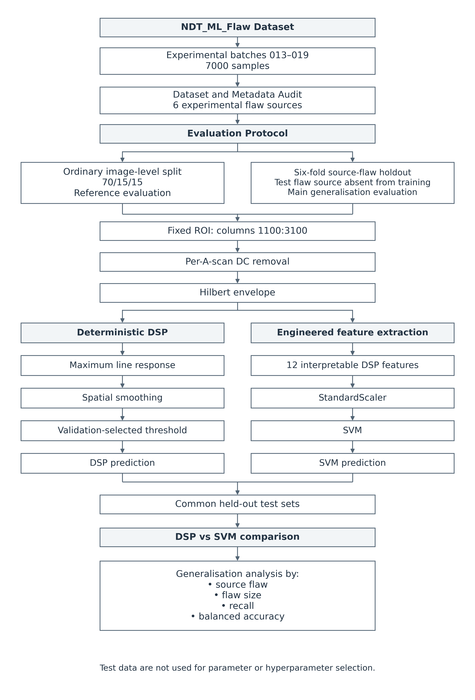
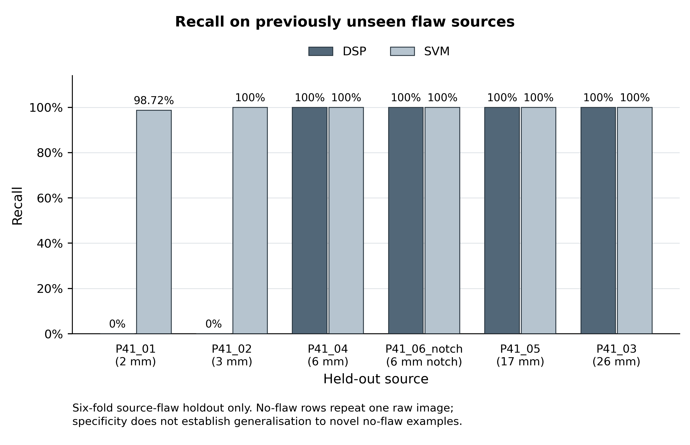
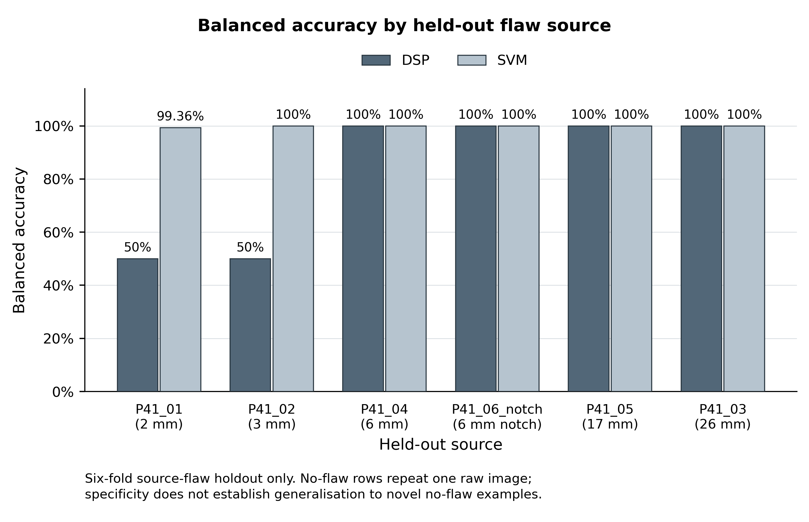
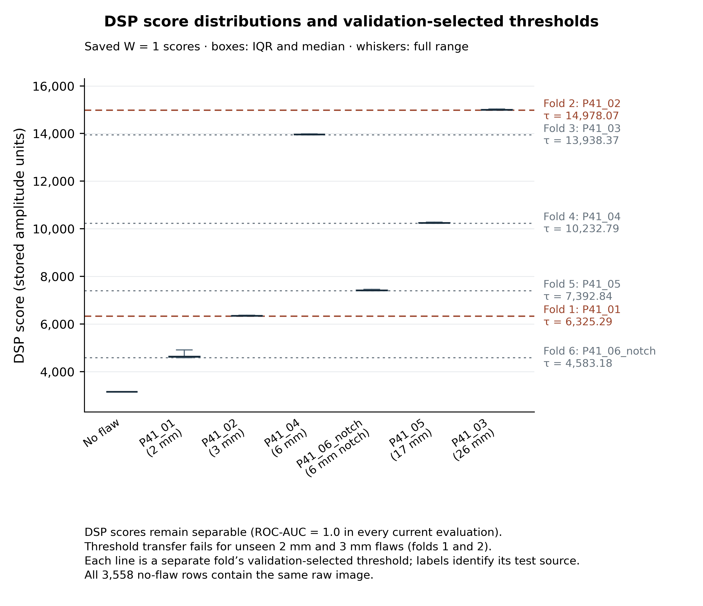

# Generalisation and Robustness of DSP and Machine Learning for Ultrasonic Flaw Detection

**ELEC5305 — Project Feedback Two**

[Project proposal](proposal/ELEC5305_Project_Proposal_Ultrasonic_Crack_Detection.pdf) · [Results summary CSV](docs/methodology/results_table_submission2.csv)

## 1. Project overview

This repository packages the completed first-half ELEC5305 experiment: dataset
auditing, fixed evaluation manifests, a deterministic DSP detector and an
engineered-feature SVM. It compares generalisation to held-out experimental flaw
sources. Saved scientific results and model outputs are preserved.

## 2. Research question

How well do deterministic DSP and engineered-feature machine learning
generalise to previously unseen ultrasonic flaw sources?

## 3. Dataset

The first-half experiment uses NDT_ML_Flaw experimental batches **013–019**:
**7,000 samples**, comprising **3,442 flaw** and **3,558 no-flaw** rows.
The six experimental source flaws are P41_01, P41_02, P41_03, P41_04,
P41_05 and P41_06_notch. Images are decoded as 480 × 7168 little-endian
int16 arrays; decoding evidence is in the inspection report.

Raw dataset files are excluded. `data/metadata.csv` includes both experimental
and simulated metadata; batches 201–210 are not part of the current experiment.
Derived features, audits and split manifests are included. Obtain the original dataset from [NDT_ML_Flaw](https://github.com/koomas/NDT_ML_Flaw); raw images are not included in this repository.

## 4. Dataset audit

`audit_dataset.py` checks metadata structure and preserves original values.
`audit_source_flaws.py` records six P41 source labels and their size/depth groups.
`inspect_ultrasonic_data.py` checks decoding, metadata alignment and batch scaling.
Feature extraction records SHA-256 hashes of raw images.

The six experimental sizes are 2, 3, 26, 6, 17 and 6 mm in source order.
Two sources share a size, so size is not a source identifier. The source audit
documents uncertainty in physical identity/codebook and simulated size encoding;
the simulated count discrepancy with the paper remains unresolved.
See [audit evidence](data/source_flaw_audit_notes.md).

## 5. Evaluation protocol

The ordinary **70/15/15 image-level split** has 4,900 training, 1,050 validation
and 1,050 test rows. It is a **reference result only**, not the primary evidence
of generalisation.

The main experiment is **six-fold leave-one-source-flaw-out evaluation**. Each
fold tests one P41 source, validates on the next source cyclically, and trains
on the other four. Six fixed groups of 593 negative rows rotate through the same
roles. These are row partitions, not independent negative acquisitions.
Seeds are 42 for ordinary allocation and 43 for negative-group allocation.
The holdout manifest contains 42,000 assignments (7,000 per fold).

Validation data select thresholds, hyperparameters and models. **Test data are
not used for tuning.** Existing manifests are frozen and included under
[`data/splits/`](data/splits/README.md).

## 6. DSP baseline

DSP uses fixed ROI `1100:3100`, per-A-scan DC removal, the Hilbert envelope,
line-level maximum response, spatial smoothing and a validation-selected threshold.
Candidate smoothing windows are 1, 3, 5 and 7 scan lines with valid boundaries.
The detector score is the maximum smoothed spatial response; decisions use
`score >= threshold`. Ties select the highest optimal threshold, then the
smallest window. Window 1 was selected in every current evaluation.
No depth/location annotations enter the detector computation.



[Scalable methodology diagram](docs/methodology/methodology_pipeline.svg)

## 7. Engineered-feature SVM

The SVM uses 12 physically interpretable DSP features from the same fixed ROI:
maximum, 95th percentile and mean envelope; RF RMS and energy; envelope energy;
crest factor; strong-peak count; spatial persistence; strongest-response width;
and standard deviation and mean of line peaks.

`StandardScaler` and SVM are fitted on training data only. Validation balanced
accuracy selects linear/RBF hyperparameters; there is no training-plus-validation
refit. Linear C candidates are 0.01, 0.1, 1, 10, 100; RBF C candidates are
0.1, 1, 10, 100 with gamma `scale`, 0.001, 0.01, 0.1, 1. Fixed grid order breaks
ties. Labels, source IDs, flaw size/depth/location and hashes are excluded from
the 12-column model input. PCA is a diagnostic visualisation only.

## 8. Results

| Held-out source | Size (mm) | DSP recall | SVM recall |
|---|---:|---:|---:|
| P41_01 | 2 | 0% | 98.7203% |
| P41_02 | 3 | 0% | 100% |
| P41_03 | 26 | 100% | 100% |
| P41_04 | 6 | 100% | 100% |
| P41_05 | 17 | 100% | 100% |
| P41_06_notch | 6 | 100% | 100% |

**DSP continuous score retained ROC-AUC = 1.0 in all current evaluations.**
Its failure on P41_01 and P41_02 was due to transfer of the validation-selected
operating threshold, not loss of score ranking. The SVM missed 7 of 547 P41_01
rows (540 true positives); all other held-out-source positives were detected.
Both ordinary-reference tests achieved accuracy and recall of 100%.

Full-precision evidence: [DSP summary](results/dsp_baseline/dsp_summary.csv),
[SVM summary](results/svm/svm_summary.csv),
[comparison](results/svm/dsp_vs_svm.csv) and
[SVM report](results/svm/svm_report.md).



[Recall SVG](docs/methodology/figure_recall_by_source.svg)



[Balanced accuracy SVG](docs/methodology/figure_balanced_accuracy_by_source.svg)



[Score/threshold SVG](docs/methodology/figure_dsp_score_thresholds.svg) · [Full-precision figure data](docs/methodology/results_table_submission2.csv)

These figures use saved CSV outputs only. They do not involve new model fits or experiments.

## 9. Important dataset limitation

**All 3,558 experimental no-flaw rows contain the same raw image. Therefore,
specificity does not demonstrate generalisation to novel no-flaw examples.**
The absence of false positives concerns one repeated background. Related
augmented positives and duplicate content also limit image-level independence.
Ordinary image-level performance is a reference result and should not be treated
as the primary evidence of generalisation. Source holdout probes the six source
labels on a shared experimental background; it does not establish generalisation
to new specimens or diverse acquisition conditions.

## 10. Repository structure

```text
src/                        Implementation and reporting helpers
tests/                      DSP/SVM tests and saved-result verification
data/                       Metadata, audit CSVs and engineered features
  splits/                   Frozen ordinary and source-holdout manifests
results/
  data_inspection/          Inspection CSVs, figures and report
  dsp_baseline/             DSP metrics, predictions, diagnostics and figures
  svm/                      SVM metrics, figures, provenance and saved pipelines
proposal/                   Original project proposal PDF
docs/methodology/           Methodology/results figures, evidence and preservation hashes
requirements.txt            Direct Python dependencies, pinned to local versions
.gitignore                  Raw-data and local-environment exclusions
README.md
```

See [full packaged tree](docs/methodology/repository_tree.txt) and
[packaging notes](docs/methodology/README.md).

## 11. Reproduction instructions

Use Python 3.11 (the original environment was 3.11.9). From the repository root:

```powershell
python -m venv .venv
.venv\Scripts\Activate.ps1
python -m pip install -r requirements.txt
$env:PYTHONPATH = (Resolve-Path src).Path
python -m unittest discover -s tests -v
python tests/verify_dsp_results.py
```

On POSIX shells, activate with `source .venv/bin/activate` and set
`export PYTHONPATH="$PWD/src"`. Tests use included features and saved models;
the raw dataset is not needed. The DSP verifier rewrites its verification JSON.
Saved provenance JSON uses historical Windows paths; verification handles these
without changing those artifacts. The existing optional `.python_deps` lookup
is retained for compatibility; clean installations use the virtual environment.

To regenerate the experiment, obtain the original NDT_ML_Flaw dataset separately.
Place one dataset copy under `NDT_ML_Flaw-master/` with its `datasets/batch_*.txt`
and `.xz` files. Automatic discovery requires a single matching dataset folder.
Run the following in a separate working copy because they overwrite derived
artifacts; packaging itself did not rerun these computations:

```powershell
python src/audit_dataset.py
python src/audit_source_flaws.py
python src/create_evaluation_splits.py
python src/inspect_ultrasonic_data.py
python src/dsp_baseline.py
python src/dsp_diagnostics.py
python tests/verify_dsp_results.py
python src/extract_features.py
python src/svm_baseline.py
python src/finalize_svm_report.py
```

The metadata audit accepts `--dataset-dir` explicitly. Other raw-data stages
discover files under the repository. Included historical reports retain their
original command spellings; use the relocated paths above.

## 12. Future work

Planned extensions are a compact CNN, controlled noise robustness experiments,
simulated-to-real evaluation, and FMC/TFM localisation. These experiments have
**not** been completed in the current first-half project. Future evaluation also
needs genuinely diverse no-flaw acquisitions.

## 13. References

- Koskinen et al. (2021), [DOI: 10.1007/s10921-021-00757-x](https://doi.org/10.1007/s10921-021-00757-x),
  the dataset paper referenced by the existing source-flaw audit.
- NDT_ML_Flaw upstream README and metadata distributed with the original dataset;
  these describe image dimensions, ROI and the 2xx simulated-batch designation.
- Local [source-audit evidence](data/source_flaw_audit_notes.md),
  [evaluation protocol](data/splits/README.md) and
  [methodology index](docs/methodology/README.md).
